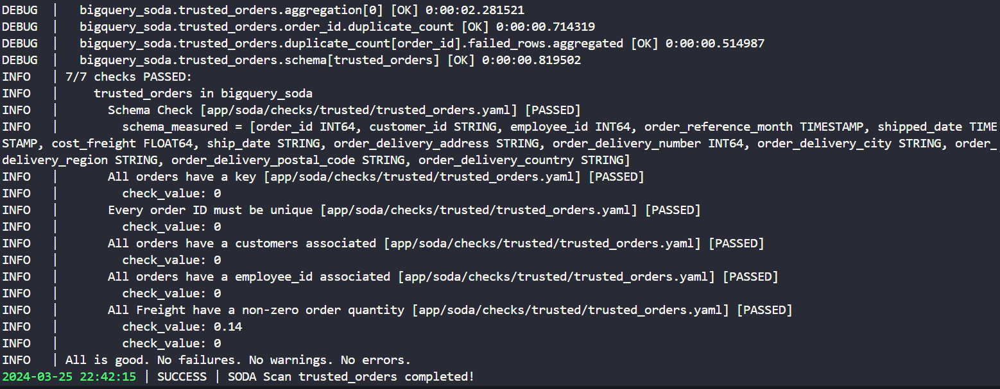

# Pipeline de Qualidade de Dados com SODA

## Descrição
Este projeto implementa um pipeline de qualidade de dados usando o SODA (SQL Optimized Data Audit) para conjuntos de dados do BigQuery. Ele carrega dados brutos de um arquivo CSV para o BigQuery, realiza verificações de qualidade usando o SODA, extrai os dados brutos do BigQuery, os transforma e carrega os dados transformados de volta para o BigQuery enquanto executa verificações do SODA em cada etapa do processo.

### Fluxo do Pipeline


## Estrutura do Projeto

```bash
├── app/
│   ├── input_data/
│   │   ├── orders.csv
│   │
│   ├── soda/
│   │   ├── __init__.py
│   │   ├── configuration.yaml
│   │   ├── scan_operations.py
│   │   └── checks/
│   │       ├── __init__.py
│   │       ├── raw/
│   │       │   ├── raw_orders.yaml
│   │       └── trusted/
│   │           ├── trusted_orders.yaml
│   ├── __init__.py
│   ├── bigquery.py
│   ├── duckdb_operations.py
│   ├── pipeline.py
│   ├── utils.py
├── tests/
│   ├── __init__.py
├── .env
├── .gitignore
├── .python-version
├── poetry.lock
├── pyproject.toml
├── requirements.txt
└── README.md
``````

## Requisitos

Certifique-se de ter os seguintes pré-requisitos instalados:

- [Google Cloud SDK](https://cloud.google.com/sdk)
- [Python](https://www.python.org/)
- [Poetry](https://python-poetry.org/docs/)

## Instalação
Para a instalação do projeto, siga as instruções abaixo:

1. Clone o repositório:

    ```bash
    git clone https://github.com/marcus-moura/soda-dataquality-pipeline-orders.git
    ```
2. Navegue até o diretório do projeto recém-clonado:

    ```bash
    cd soda-dataquality-pipeline-orders
    ```
### Utilizando `pip`

Se você preferir usar o `pip` para instalar as dependências, siga estas etapas:

1. **Criação e Ativação do Ambiente Virtual Python:**

    - No Linux:
        ```bash
        python3 -m venv venv
        source venv/bin/activate
        ```

    - No Windows:
        ```bash
        python3 -m venv venv
        .\venv\Scripts\activate
        ```

2. **Instalação dos Pacotes Python Necessários:**

    Execute os seguintes comandos para instalar os pacotes listados nos arquivos `requirements.txt`

    ```bash
    pip install -r requirements.txt
    ```

### Utilizando Poetry

Se você preferir usar o gerenciador de pacotes Poetry, siga estas etapas:

1. **Instalação das Dependências com Poetry:**

    Instale as dependências do projeto usando Poetry:

    ```bash
    poetry install
    ```

2. **Ativação do Ambiente Virtual:**

    Ative o ambiente virtual criado pelo Poetry:

    ```bash
    poetry shell
    ```

## Configuração
### Configuração Google Cloud
Para que o soda consiga executar as verificação no BigQuery é necessário ter uma service account com a role `BigQuery Admin`.

Cria sua service account e faça o download da chave Json.

### Configuração das Variáveis de Ambiente

Após instalar as dependências, certifique-se de configurar as variáveis de ambiente necessárias em um arquivo ``.env``.

> ⚠️ Utilize o arquivo ``exemple.env`` como base.

Para exportar as variáveis você pode utilizar os seguintes comandos no seu bash:

```bash
source .env
```

ou utilizando o comando `export` com `xargs`:

```bash
export $(cat .env | xargs)
```

## Uso

Para executar o pipeline de qualidade de dados, certifique-se de que as variáveis de ambiente foram expostas corretamente.

Windows:
```powershell
python -m app.pipeline run `
    --project_id $env:PROJECT_ID `
    --location $env:LOCATION `
    --dataset_id $env:DATASET_ID `
    --file_source $env:FILE_SOURCE `
    --table_raw $env:TABLE_RAW `
    --table_trusted $env:TABLE_TRUSTED
```
Linux ou terminal bash:
```bash
python -m app.pipeline run \
    --project_id $PROJECT_ID \
    --location $LOCATION \
    --dataset_id $DATASET_ID \
    --file_source $FILE_SOURCE \
    --table_raw $TABLE_RAW \
    --table_trusted $TABLE_TRUSTED
```

No terminal você verá as verificações do ``Soda`` sendo executadas, como na imagem abaixo:



## Contribuição

Você pode contribuir para este projeto de várias maneiras:

- Reportando bugs
- Sugerindo novos recursos
- Enviando pull requests

Por favor, sinta-se à vontade para contribuir!

## Contato

Se você tiver dúvidas ou sugestões, entre em contato comigo em marcuspaulo.moura@hotmail.com.

## Links Úteis

- [Documentação do Google Cloud SDK](https://cloud.google.com/sdk)
- [Python](https://www.python.org/)
- [Soda](https://docs.soda.io/)

